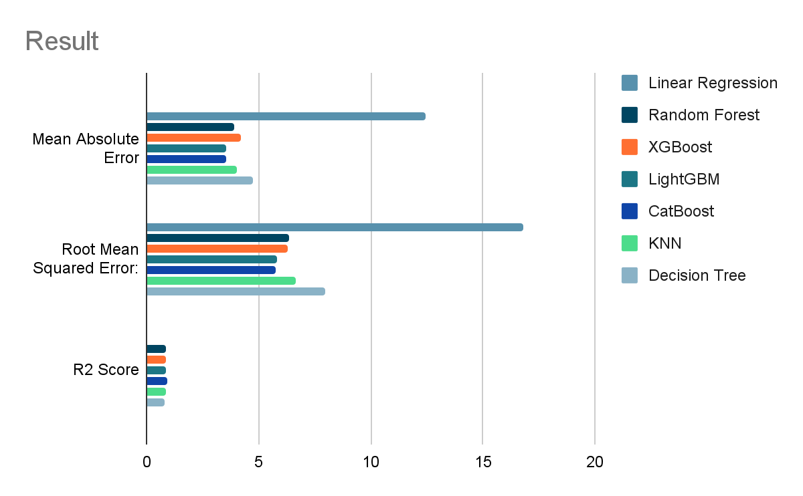

# NYC Taxi Fare Prediction using Machine Learning

This is a project we did in Artificial Intelligence course, applying some of the techniques we learned in previous
course of Applied Data Science. The goal of this project is to predict the fare for taxi rides in NYC using the
available public dataset. The model will help taxi companies and drivers to have a better understanding of the prices
they can charge their customers, and make more informed business decisions.

## Data

The data used in this project was obtained from the NYC Taxi and Limousine Commission (TLC) and contains information on
over 170 million taxi rides in NYC from 2009 to 2015. The dataset includes the following features:

- pickup_datetime: date and time of the pickup
- pickup_longitude: longitude coordinate of the pickup location
- pickup_latitude: latitude coordinate of the pickup location
- dropoff_longitude: longitude coordinate of the dropoff location
- dropoff_latitude: latitude coordinate of the dropoff location
- passenger_count: number of passengers in the taxi
- distance: distance between pickup and dropoff locations
- fare_amount: fare charged for the ride

## Model Training & Testing

A total of 7 machine learning models were used to predict the taxi fare in New York City. The models used in this
project are:

- Linear Regression
- Random Forest
- XGBoost
- LightGBM
- CatBoost
- KNN (K-Nearest Neighbors)
- Decision Tree Regressor

## Comparison Analysis

| Models                   | Linear Regression | Random Forest | XGBoost | LightGBM | CatBoost | KNN    | Decision Tree |
| ------------------------ | ----------------- | ------------- | ------- | -------- | -------- | ------ | ------------- |
| Mean Absolute Error      | 12.44             | 3.9           | 4.17    | 3.56     | 3.54     | 4      | 4.74          |
| Root Mean Squared Error: | 16.8              | 6.33          | 6.3     | 5.83     | 5.73     | 6.63   | 7.95          |
| Mean Squared Error       | 282.18            | 40.04         | 39.64   | 34.04    | 32.78    |  43.97 |  63.32        |
| R2 Score                 | 0.03              | 0.86          | 0.86    | 0.88     | 0.89     | 0.85   | 0.78          |

## Result

## Future Work

In the future, we plan to expand this project by incorporating data from Dhaka City to predict the taxi fares in Dhaka.

## Contributors

